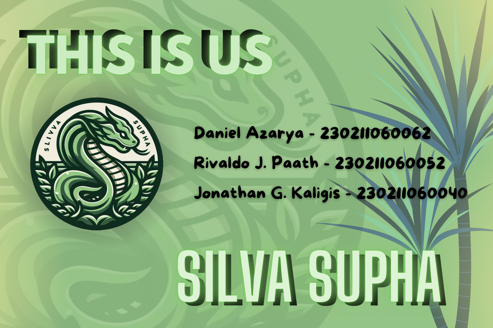
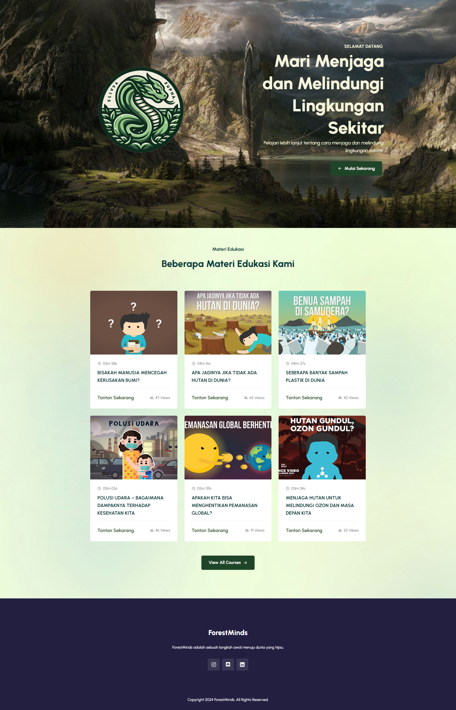
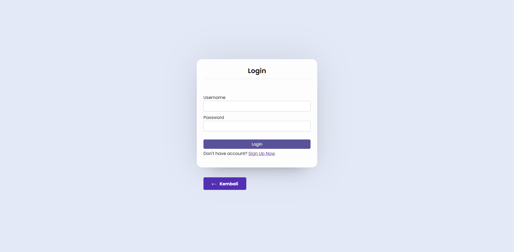
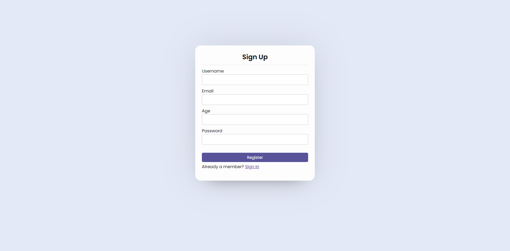
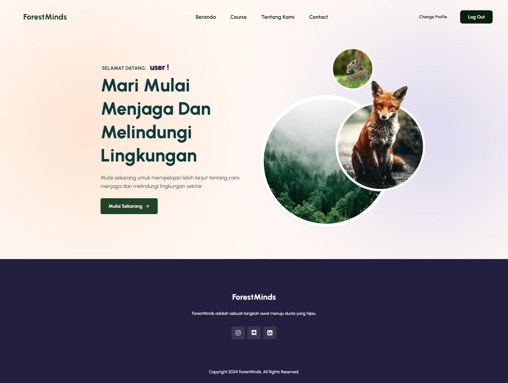
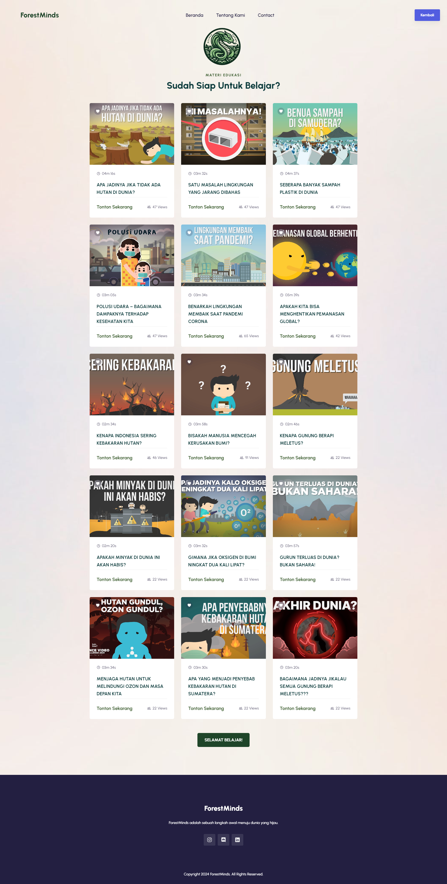
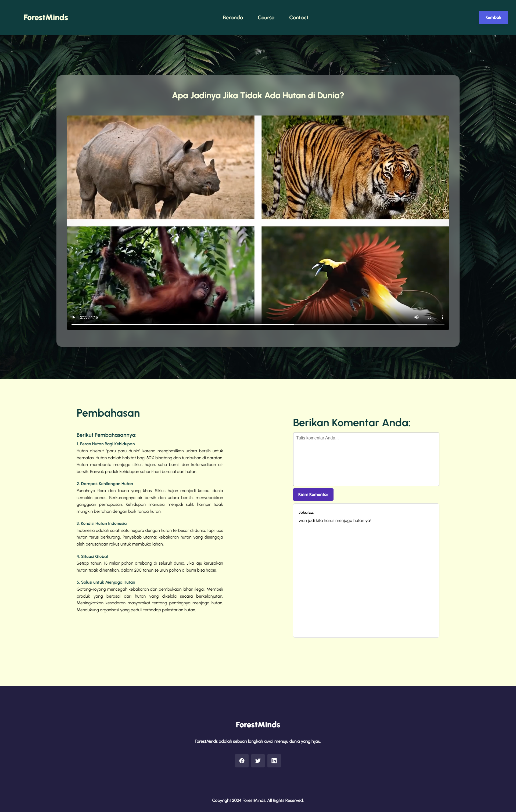
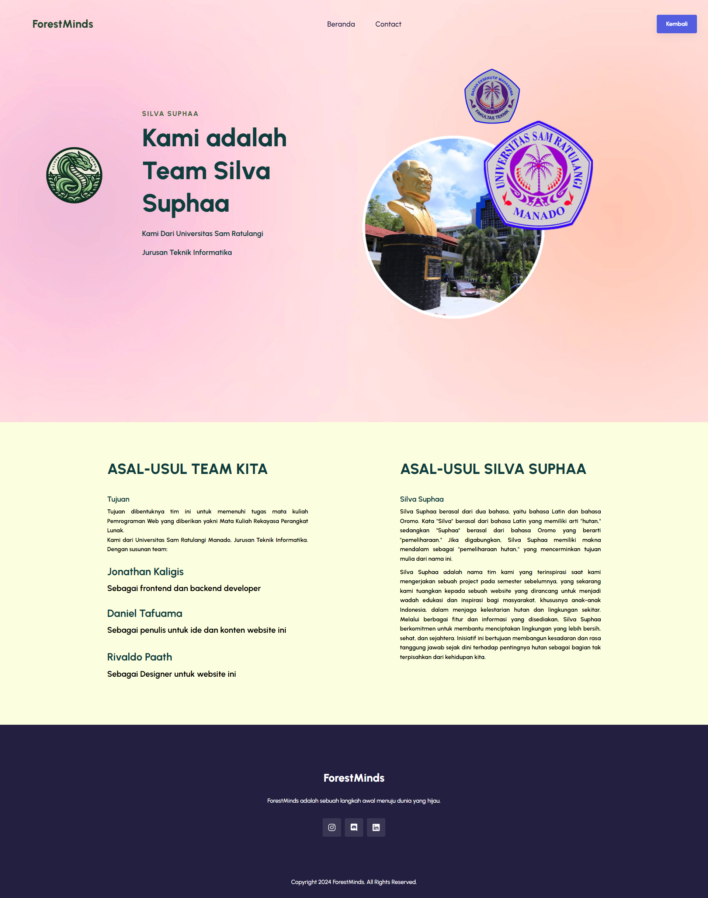
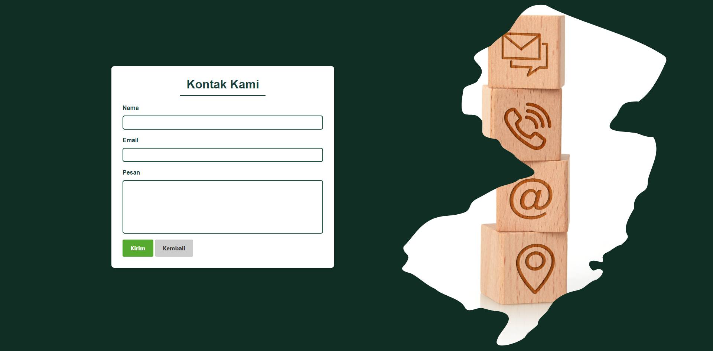

<div align="center">
  
  
  
  
  [](https://youtu.be/dMZujoGxjRo)

  <br />
  <br />

  <h2 align="center">ForestMinds - Website Edukasi</h2>

  ForestMinds adalah adalah sebuah langkah awal menuju dunia yang hijau.

</div>

<br />
DaAzTa -> Daniel Azarya Tafuama (230211060062)
<br />
denanzen -> Rivaldo Jonathan Paath (230211060052)
<br />
jokalzz -> Jonathan Gabrilio Kaligis (230211060040)

<br />

### This Is Us


### Demo Screeshots










### Persiapan download

Sebelum mulai jangan lupa install Git

* [Git](https://git-scm.com/downloads "Download Git") install terlebih dahulu

### Penggunaan Project

Cara menggunakan project ini **ForestMinds** di lokal gunakan komen ini:

Linux and macOS:

```bash
sudo git clone https://github.com/jokalzz/ForestMinds.git
```

Windows:

```bash
git clone https://github.com/jokalzz/ForestMinds.git
```

### License

**free to use** 
